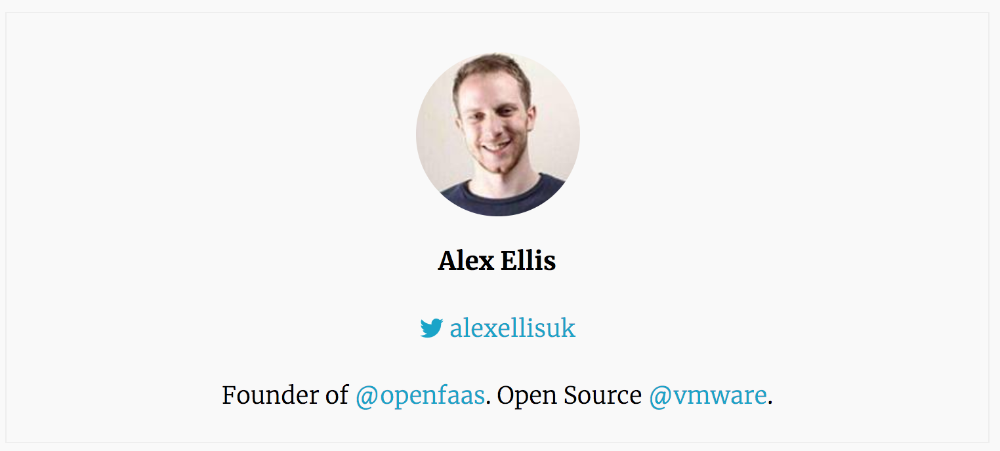

# OpenFaaS Website and Blog

This repository contains the OpenFaaS webpage and blog - https://www.openfaas.com, created using Jekyll and a modified fork of the [CloudCannon Frisco template](https://github.com/CloudCannon/frisco-jekyll-template) and built/hosted using Github Pages.

## Contributing

The following sections provide a basic guide to some common changes that will be made to the site, adding posts, authors etc.

### Developing locally

A Docker Compose file is provided to simplify developing/contributing to the website and blog, this has been verified to work on both OSX and Windows 10 (when developing/writing on Windows please use Unix line endings in your editor).

Run the site locally with:

    docker-compose up

This will make the site available locally at - http://localhost:4000.

    Starting openfaas-www_openfaas-jekyll_1 ... done
    Attaching to openfaas-www_openfaas-jekyll_1
    openfaas-jekyll_1  | ruby 2.5.1p57 (2018-03-29 revision 63029) [x86_64-linux-musl]
    openfaas-jekyll_1  | Configuration file: /srv/jekyll/_config.yml
    openfaas-jekyll_1  |             Source: /srv/jekyll
    openfaas-jekyll_1  |        Destination: /srv/jekyll/_site
    openfaas-jekyll_1  |  Incremental build: disabled. Enable with --incremental
    openfaas-jekyll_1  |       Generating...
    openfaas-jekyll_1  |       Remote Theme: Using theme cloudcannon/frisco-jekyll-template
    openfaas-jekyll_1  |                     done in 3.074 seconds.
    openfaas-jekyll_1  |  Auto-regeneration: enabled for '/srv/jekyll'
    openfaas-jekyll_1  |     Server address: http://0.0.0.0:4000
    openfaas-jekyll_1  |   Server running... press ctrl-c to stop.

Any changes made to the site in your editor will be picked up inside the container and the site will be regenerated (**note** this does not include changes to `_config.yml`, you must restart the docker container to pick up those changes).

For example, if you add your own post in `_posts/2018-07-31-my-post.md` you will see Jekyll detect the change and regenerate the site, refreshing your browser will pick up any changes.

    openfaas-jekyll_1  |       Regenerating: 1 file(s) changed at 2018-07-31 21:28:36
    openfaas-jekyll_1  |                     _posts/2018-08-22-my-post.md
    openfaas-jekyll_1  |       Remote Theme: Using theme cloudcannon/frisco-jekyll-template
    openfaas-jekyll_1  |                     ...done in 2.0199265 seconds.

### Adding an Author

In order to have a blog post properly attributed to an author you must create an `<author_name>.md` file in the `_staff_members` directory.

Attribution in a blog post is based on the filename.

For example, `_staff_members/alex.md` can be used for attribution by setting the following metadata a post:

    author_staff_member: alex

Which results in an author box being displayed with each assigned post:

The author definition takes the following format:

    ---
    name: Alex Ellis
    position: Founder
    image_path: /images/author/ellis.jpg
    twitter_username: alexellisuk
    blurb: Founder of <a href="https://twitter.com/openfaas">@openfaas</a>. Open Source <a     href="https://twitter.com/vmware">@vmware</a>.
    ---

Key | Details
------------ | -------------
name | Full name of the contributing author
position | Free text description of their relationship to the project
image_path | Path to the authors portrait, this should be a 154px * 154px image
twitter_username | Authors Twitter handle (with no `@`)
blurb | Free text information about the user, this should be very short

### Contributing a post

Contributing a post is as straight forward as raising a PR containing your post in markdown format along with any embedded images.

Your post markdown should be created in the `_posts` directory and the file should take the following structure.

    yyyy-mm-dd-short-description-of-post.md

If you're in doubt take a look at the existing posts for ideas on what is acceptable.

The post consists of two parts, a [YAML Front Matter](https://jekyllrb.com/docs/frontmatter/) header which describes the post and provides Jekyll with cues for rendering/attribution etc, and the post body which is just standard Markdown.

#### YAML Front Matter

The post metadata takes the following form:

    ---
    title: Introducing the OpenFaaS Operator for Serverless on Kubernetes
    date: 2018-07-14
    image: /images/kubernetes-operator-crd/pexels-asphalt-blue-sky-clouds-490411.jpg
    categories:
      - kubernetes
    author_staff_member: alex
    canonical_url: https://blog.alexellis.io/introducing-the-openfaas-operator/
    ---

Key | Details
------------ | -------------
title | Title of the blog post
date | Publish date of the blog post in `yyyy-mm-dd` format
image | Path to image which will be displayed behind the title, this should be added in a directory with the same name as the blog post under the `images` directory.
categories | An optional list of categories which the post falls under, you should always reuse existing categories from earlier posts where feasible
author_staff_member | Name of the authors file in `_staff_members` directory, used for attribution (see previous section)
canonical_url | You **must** set this field if the blog post has already been published at another URL. Preference is given to original content.

#### Post Body

While Jekyll supports multiple formats, you should submit your post in Markdown format.

The following guide describes the syntax:

 - https://daringfireball.net/projects/markdown/

It is also very useful to compare existing posts with the underlying markdown files when you want to learn how to format your post.

Adding images uses the normal Markdown format, and while external images are possible it is preferred that you include any images in your PR, these should go in a directory with the same name as the post under the `images` directory, for example `images/kubernetes-operator-crd/`.

**Note** take care to only include sensible image sizes, you should ensure that you have resized/processed any images before adding them to your PR.

### Styling

The site uses the [SASS](https://sass-lang.com/) Stylesheet language, any alterations to the sites look and feel must be made using SASS, do not contribute raw `.css` files. 

### Altering the Header and Footer

The sites navbar and footer are configured via YAML in the following files:

 - `_data/footer.yml`
 - `_data/navigation.yml`

Adding entries to either should be as a last resort as they must not become cluttered.

### Further Reading

For a more detailed understanding of how the site is built please refer to the Jekyll and Github Pages documentation:

 - [Jekyll Documenation](https://jekyllrb.com/docs/home/)
 - [Using Jekyll with Github Pages](https://help.github.com/articles/using-jekyll-as-a-static-site-generator-with-github-pages/)

 The site also uses the following plugins:

  - [jekyll-sitemap](https://github.com/jekyll/jekyll-sitemap)
  - [jekyll-seo-tag](https://github.com/jekyll/jekyll-seo-tag)
  - [jekyll-feed](https://github.com/jekyll/jekyll-feed)
  - [jekyll-paginate](https://jekyllrb.com/docs/pagination/)
  - [jekyll-archives](https://github.com/jekyll/jekyll-archives)

Refer to the documenation above for details on how each plugin can be used and configured.
